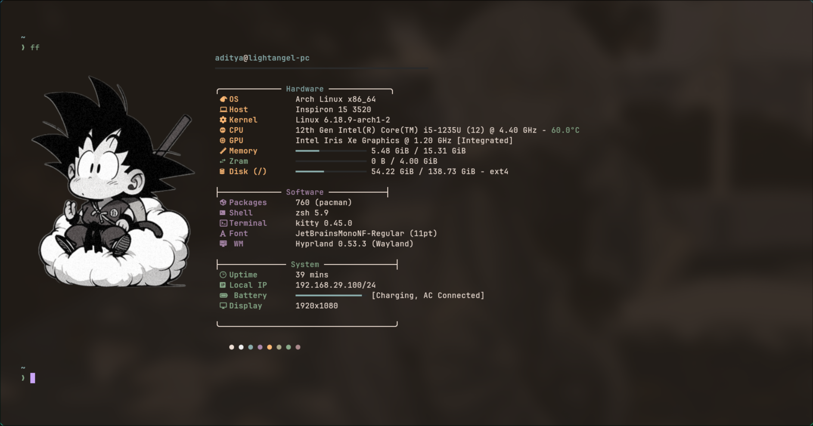
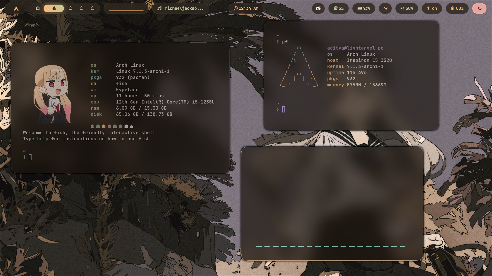

# 🌌 Dotfiles: Arch + Hyprland + Fish

Welcome to my personal dotfiles repository! This setup is designed for a clean, modern, and highly functional Wayland-based desktop experience on Arch Linux, powered by **Hyprland** and optimized with the **Fish** shell.

<p align="center">
  
  
</p>

---

## 🎨 Badges

<p align="center">
  <a href="https://archlinux.org/"></a>
  <a href="https://hyprland.org/"></a>
  <a href="https://fishshell.com/"></a>
  <a href="https://sw.kovidgoyal.net/kitty/"></a>
  <a href="https://neovim.io/"></a>
</p>

---

## ✨ Features

- 🌈 **Dynamic Theming**: Integrated with **Matugen** and `swww` for Material You-style color generation. Click the Arch logo in Waybar or run `~/.config/waybar/change_theme.sh` to cycle wallpapers from `~/walls/` and regenerate system-wide colors automatically.
- 👁️ **Eye Candy**: Optimized blur, rounded corners, shadows, and smooth spring animations using Hyprland's native effects.
- 📊 **Custom Status Bar**: Highly customized **Waybar** featuring:
  - Custom workspace icons.
  - Dynamic network and Bluetooth status.
  - Clickable modules for volume, brightness, and theme switching.
- ⚡ **Fish Shell Best Practices**:
  - Fully modular Fish shell configuration split logically into `conf.d/` (`env`, `aliases`, `bindings`, `prompt`, `conda`).
  - Native abbreviations (`abbr`) for instant interactive expansion and faster shell startup.
  - Autoloaded custom functions (e.g., Yazi wrapper, clean-all tool).
- 🛠️ **Productivity & Utilities**:
  - **Neovim** (LazyVim based) configured for a full IDE-like experience.
  - **Tmux** for terminal multiplexing and session persistence.
  - **SwayNC** for a modern notification center.
  - **Battery Alert Daemon**: Automatic notifications when battery drops below 15%.
- 🎵 **Audio Visuals**: **Cava** configured with custom shaders for visualizer aesthetics.

---

## 🛠️ Software Stack

| Component | Software | Description |
| :--- | :--- | :--- |
| **Window Manager** | [Hyprland](https://hyprland.org/) | Dynamic tiling Wayland compositor |
| **Status Bar** | [Waybar](https://github.com/Alexays/Waybar) | Customizable Wayland status bar |
| **Terminal Emulator** | [Kitty](https://sw.kovidgoyal.net/kitty/) | GPU-accelerated terminal emulator |
| **Shell** | [Fish](https://fishshell.com/) / Zsh | Modular Fish shell setup & Zsh fallback |
| **App Launcher** | [Rofi-lbonn](https://github.com/lbonn/rofi) | Wayland-supported application launcher |
| **Notification Daemon**| [SwayNC](https://github.com/ErikReider/SwayNotificationCenter) | Simple Wayland notification center |
| **Lockscreen & Idle** | [Hyprlock](https://github.com/hyprwm/hyprlock) / Hypridle | Fast and customizable locks and idle handlers |
| **Wallpaper Daemon** | [Swww](https://github.com/L_S_D/swww) | Animated wallpaper daemon for Wayland |
| **Theming Engine** | [Matugen](https://github.com/InSyncWithQueries/matugen) | Material You color generator |
| **File Manager** | [Yazi](https://github.com/sxyazi/yazi) / Dolphin | Terminal file manager & GUI alternative |
| **Audio Visualizer** | [Cava](https://github.com/karlstav/cava) | Console-based audio visualizer |

---

## ⌨️ Keybindings

The `SUPER` key is mapped as the primary modifier.

| Keybinding | Action |
| :--- | :--- |
| `SUPER + Q` | Open Terminal (Kitty) |
| `SUPER + E` | Open File Manager (Dolphin) |
| `SUPER + R` | Open App Launcher (Rofi) |
| `SUPER + C` | Close Active Window |
| `SUPER + M` | Exit Hyprland session |
| `SUPER + V` | Toggle Floating Mode |
| `SUPER + X` | Open Notification Center (SwayNC) |
| `PRINT` | Screenshot active window |
| `SHIFT + PRINT` | Screenshot selected region |
| `SUPER + [1-0]` | Switch to Workspace [1-10] |

---

## 📁 Repository Structure

```text
.
├── .config/
│   ├── bimagic/      # Bimagic widget configuration
│   ├── cava/         # Audio visualizer shaders and config
│   ├── fastfetch/    # Fastfetch layouts
│   ├── fish/         # Structured Fish shell configurations
│   ├── hypr/         # Hyprland, Hyprlock, Hypridle configurations
│   ├── kitty/        # Kitty styles and settings
│   ├── matugen/      # Material You generation templates
│   ├── nvim/         # Neovim (LazyVim) setup
│   ├── rofi/         # Rofi menu styles and launcher theme
│   ├── swaync/       # Notification center configurations
│   ├── waybar/       # Waybar configuration and modules
│   ├── wlogout/      # Logout menu configuration
│   └── yazi/         # Yazi terminal file manager configuration
├── tmux/             # Tmux configuration
├── .zshrc            # Legacy/fallback Zsh config
└── README.md         # This documentation
```

---

## 🚀 Getting Started

### 1. Clone the repository
```bash
git clone https://github.com/your-username/dotfiles.git ~/dotfiles
```

### 2. Install Dependencies
Install Hyprland, Waybar, Rofi, Matugen, Swww, SwayNC, Cava, Fish shell, and other components using your system's package manager (e.g., `pacman` or `yay` on Arch Linux).

### 3. Deploy Configurations

#### Option A: Deploy using GNU Stow (Recommended)
This repository is configured out-of-the-box for [GNU Stow](https://www.gnu.org/software/stow/). Navigate to your dotfiles directory and stow the configs:
```bash
cd ~/dotfiles
stow .
```

#### Option B: Deploy Manually
If you prefer not to use Stow, you can copy the `.config` directory manually:
```bash
cp -r ~/dotfiles/.config/* ~/.config/
cp ~/dotfiles/.zshrc ~/.zshrc
```

### 4. Dynamic Theme Generation
Matugen templates are ready in `~/.config/matugen/`. Run the wallpaper switcher utility script to build your color scheme:
```bash
~/.config/waybar/change_theme.sh
```
