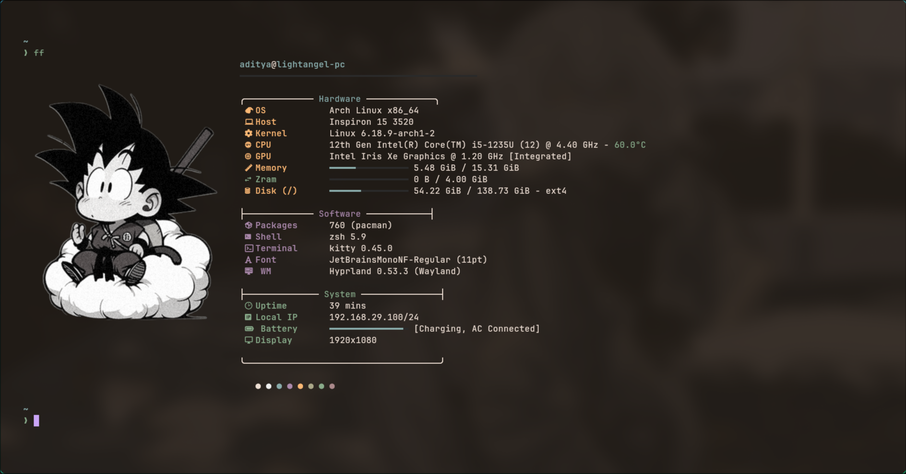
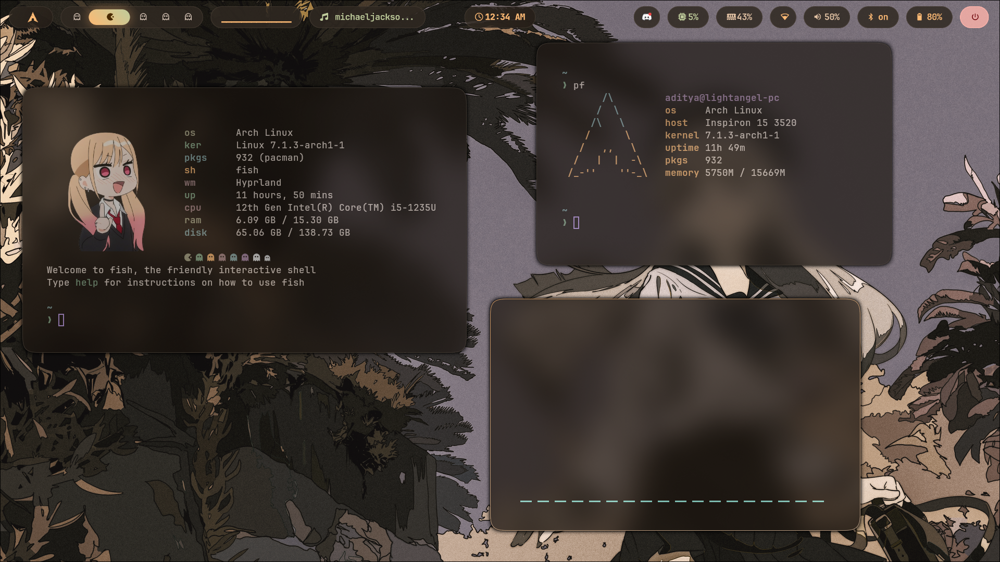

<div align="center">

# 🌌 Aditya's Dotfiles

### *A modern, fluid, and Material Design-inspired Wayland desktop setup*

[](https://archlinux.org/)
[](https://hyprland.org/)
[](#-status-bar--desktop-shell-transition)
[](https://fishshell.com/)
[](https://sw.kovidgoyal.net/kitty/)
[](https://neovim.io/)
[](https://github.com/InSyncWithQueries/matugen)

<br/>

<p align="center">
  
  
</p>

</div>

---

## 🚀 Overview

Welcome to my personal **dotfiles**! This repository houses the configuration for my daily driver Arch Linux workstation. It features a heavily customized **Hyprland** environment built for aesthetics, snappy workflows, and seamless dynamic Material You (MD3) theming.

> [!IMPORTANT]
> ### 💊 Status Bar & Desktop Shell Transition
> I have migrated my primary desktop shell and status bar to **[ChillPill Shell](https://github.com/adityapaul26/dotfiles/tree/main/.config/chillpill-shell)** (`chillpill-shell`), an interactive Quickshell-powered UI providing dynamic top pill widgets, control center, clipboard history viewer, and mini-dashboard.
>
> 💡 **Prefer Waybar?** My complete and battle-tested **Waybar + SwayNC** configuration is still maintained and preserved inside [`.config/waybar`](file:///home/aditya/dotfiles/.config/waybar) and [`.config/swaync`](file:///home/aditya/dotfiles/.config/swaync) for anyone who wants a traditional status bar experience.

---

## ✨ Features

- 💊 **ChillPill Shell Experience**:
  - Interactive top pill modules: battery, volume, workspaces, network, clock, and weather.
  - Built-in QuickShell IPC triggers for the **App Launcher**, **Control Center**, **Mini Dashboard**, **Cliphist Clipboard Manager**, and **Wallpaper Switcher**.
- 🌈 **Dynamic Material Design 3 Theming**:
  - Powered by **Matugen** and `swww` / `awww`. System colors dynamically extract from your wallpaper across terminal emulators, Hyprland borders, and app themes.
- 🪟 **Modern Modular Hyprland**:
  - Configured with modular **Lua** (`hyprland.lua` + `.config/hypr/lua/`) for clean structure and instant reloads.
  - Smooth spring bezier curves, fluid window opening/closing animations, rounded corners, subtle shadows, and x-ray blur.
  - Scrolling window layout for natural multi-tasking.
- ⚡ **Fish Shell + Starship Prompt**:
  - Modular `conf.d/` configuration (`aliases`, `bindings`, `prompt`, `env`, `conda`).
  - Interactive abbreviations (`abbr`) for instant command expansions without alias overhead.
  - Custom Fastfetch startup banners with ASCII art presets.
- 🛠️ **Power User Tools & Multimedia**:
  - **Neovim (LazyVim)** configured for a full IDE coding experience.
  - **GPU Screen Recorder (`gsr`)**: Fast hardware-accelerated screen capture and instant replays (10s, 30s, 60s clips).
  - **Dual File Managers**: Blazing fast terminal navigation with **Yazi** and **Fyzenor**, plus **Dolphin** for GUI tasks.
  - **Tmux**: Persistent terminal sessions with sleek custom layouts.
  - **Cava**: Audio spectrum visualizer with custom shaders.

---

## 🛠️ Software Stack

| Component | Software | Description | Status |
| :--- | :--- | :--- | :--- |
| **Window Manager** | [Hyprland](https://hyprland.org/) | Dynamic Wayland compositor (Lua-configured) | **Active** |
| **Desktop Shell** | [ChillPill Shell](https://github.com/adityapaul26/dotfiles) | Modern interactive Quickshell bar & widgets | **Primary** |
| **Status Bar (Fallback)**| [Waybar](https://github.com/Alexays/Waybar) | Highly customized CSS-styled status bar | *Preserved* |
| **Terminal Emulator** | [Kitty](https://sw.kovidgoyal.net/kitty/) & [Foot](https://codeberg.org/dnkl/foot) | GPU-accelerated & lightweight Wayland terminals | **Active** |
| **Shell** | [Fish](https://fishshell.com/) & [Starship](https://starship.rs/) | Modular shell with intelligent prompt | **Active** |
| **Editor** | [Neovim](https://neovim.io/) (LazyVim) | Extensible, modern modal text editor | **Active** |
| **Theming Engine** | [Matugen](https://github.com/InSyncWithQueries/matugen) | Material You (M3) color generator | **Active** |
| **Screen Recorder** | [GPU Screen Recorder](https://git.dec05eba.com/gpu-screen-recorder/about/) | Low-overhead capture & instant replay buffer | **Active** |
| **File Managers** | [Yazi](https://github.com/sxyazi/yazi) / [Fyzenor](https://github.com/adityapaul26/dotfiles) / Dolphin | Terminal & GUI file exploration | **Active** |
| **Lockscreen & Idle** | [Hyprlock](https://github.com/hyprwm/hyprlock) & [Hypridle](https://github.com/hyprwm/hypridle) | Dynamic lockscreen with music widget support | **Active** |
| **Notification Center**| [ChillPill](https://github.com/adityapaul26/dotfiles) / [SwayNC](https://github.com/ErikReider/SwayNotificationCenter) | Wayland notification stack & control panel | **Active** |
| **Audio Visualizer** | [Cava](https://github.com/karlstav/cava) | Audio visualizer with custom shaders | **Active** |

---

## ⌨️ Keybindings

The `SUPER` key (`Windows` key) is the primary modifier across the entire environment.

### 💊 ChillPill Shell & Desktop Controls
| Keybinding | Action |
| :--- | :--- |
| `SUPER + R` | Toggle ChillPill App Launcher |
| `SUPER + SHIFT + V` | Toggle ChillPill Cliphist Clipboard History |
| `SUPER + X` | Toggle ChillPill Control Center |
| `SUPER + B` | Toggle ChillPill Mini Dashboard |
| `SUPER + W` | Toggle ChillPill Wallpaper Switcher |

### 🪟 Window Management & Navigation
| Keybinding | Action |
| :--- | :--- |
| `SUPER + Q` | Launch Terminal (Kitty) |
| `SUPER + E` | Open File Manager (Dolphin) |
| `SUPER + C` | Close Active Window |
| `SUPER + V` | Toggle Floating Window Mode |
| `SUPER + P` | Toggle Pseudo Tiling |
| `SUPER + M` | Exit Hyprland Session |
| `SUPER + [Arrow Keys]` | Move Focus (Left, Right, Up, Down) |
| `SUPER + [1-0]` | Switch to Workspace `1`–`10` |
| `SUPER + SHIFT + [1-0]` | Move Active Window to Workspace `1`–`10` |
| `SUPER + S` | Toggle Special Workspace (Scratchpad) |
| `SUPER + SHIFT + S` | Move Window to Special Workspace |
| `SUPER + Mouse Scroll` | Cycle Through Workspaces |
| `SUPER + LMB (Drag)` | Move Window |
| `SUPER + RMB (Drag)` | Resize Window |

### 🎥 Media, Screen Recording & Utilities
| Keybinding | Action |
| :--- | :--- |
| `PRINT` | Screenshot active window (`hyprshot`) |
| `SHIFT + PRINT` | Screenshot selected region (`hyprshot`) |
| `SUPER + G` | Toggle GPU Screen Recorder |
| `SUPER + SHIFT + G` | Toggle GPU Screen Recorder with Microphone |
| `SUPER + CTRL + G` | Pause GPU Screen Recorder |
| `SUPER + F8` | Save Instant Replay (Past 10 seconds) |
| `SUPER + F9` | Save Instant Replay (Past 30 seconds) |
| `SUPER + F10` | Save Instant Replay (Past 60 seconds) |
| `XF86AudioRaiseVolume` | Volume Up (`wpctl` / `swayosd`) |
| `XF86AudioLowerVolume` | Volume Down (`wpctl` / `swayosd`) |
| `XF86AudioMute` | Mute Audio Sink |
| `XF86MonBrightnessUp/Down` | Adjust Screen Brightness (`brightnessctl`) |

---

## 📁 Repository Structure

```text
.
├── .config/
│   ├── chillpill-shell/  # Modern ChillPill Shell configuration (Pills, Widgets, Controls)
│   ├── waybar/           # Classic Waybar status bar configuration, scripts & styles (Preserved)
│   ├── hypr/             # Hyprland setup (modular hyprland.lua, keybinds, animations, look & feel)
│   ├── hyprlock/         # Hyprlock configs, layouts, music widgets & scripts
│   ├── fish/             # Modular Fish configuration (conf.d: aliases, bindings, prompt, env)
│   ├── kitty/            # Kitty terminal styles, font configs & color schemes
│   ├── foot/             # Lightweight Foot terminal config
│   ├── matugen/          # Material You / MD3 dynamic color generation templates
│   ├── nvim/             # Full Neovim configuration (LazyVim based)
│   ├── rofi/             # Rofi menus & application launcher themes
│   ├── swaync/           # Sway Notification Center configs & CSS styling
│   ├── yazi/             # Yazi blazing fast terminal file manager
│   ├── fyzenor/          # Fyzenor file manager configuration & category themes
│   ├── fastfetch/        # Fastfetch layouts, ASCII art & presets
│   ├── cava/             # Cava audio visualizer shaders & configurations
│   ├── bimagic/          # Bimagic widget configurations
│   ├── wlogout/          # Wlogout power menu layout & icons
│   └── starship.toml     # Cross-shell prompt customization
├── tmux/                 # Tmux configuration & keybindings
├── .zshrc                # Fallback / legacy Zsh configuration
└── README.md             # Repository documentation
```

---

## 📥 Installation & Deployment

### 1. Clone the Repository
```bash
git clone https://github.com/adityapaul26/dotfiles.git ~/dotfiles
cd ~/dotfiles
```

### 2. Deploy Using GNU Stow *(Recommended)*
This repository is organized to be deployed seamlessly with [GNU Stow](https://www.gnu.org/software/stow/):

```bash
# From within ~/dotfiles
stow .
```

*Alternatively, copy configs manually:*
```bash
cp -r ~/dotfiles/.config/* ~/.config/
cp ~/dotfiles/.zshrc ~/.zshrc
```

### 3. Dynamic Theming with Matugen
Generate your initial color palettes across the system using Matugen:
```bash
# If using ChillPill Shell:
qs ipc -p /usr/share/chillpill-shell call wallpaperSwitcher toggle

# Or cycle wallpapers & themes via Waybar script:
~/.config/waybar/change_theme.sh
```

---

## 🤝 Acknowledgements & Credits

- [Hyprland](https://hyprland.org/) by Vaxry and the Hyprland team
- [ChillPill Shell](https://github.com/adityapaul26/dotfiles) for the desktop shell & dynamic widgets
- [Matugen](https://github.com/InSyncWithQueries/matugen) for Material You dynamic theming
- [LazyVim](https://www.lazyvim.org/) for the Neovim starter configuration
- [Waybar](https://github.com/Alexays/Waybar) & [SwayNC](https://github.com/ErikReider/SwayNotificationCenter) for classic status bar & notification tooling

---

<div align="center">
  <sub>Maintained with ❤️ by <a href="https://github.com/adityapaul26">Aditya Paul</a></sub>
</div>

